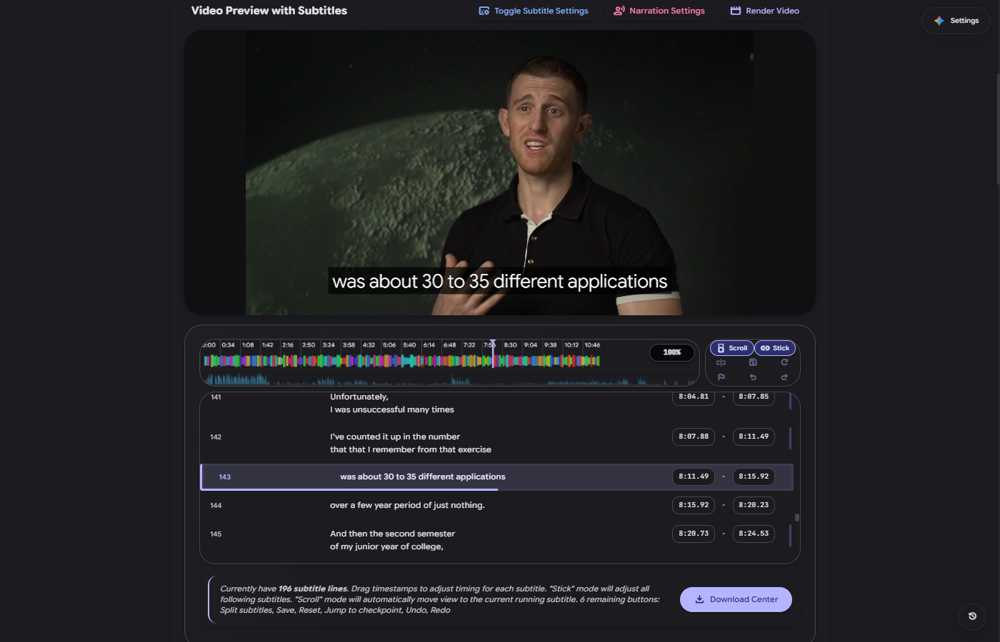
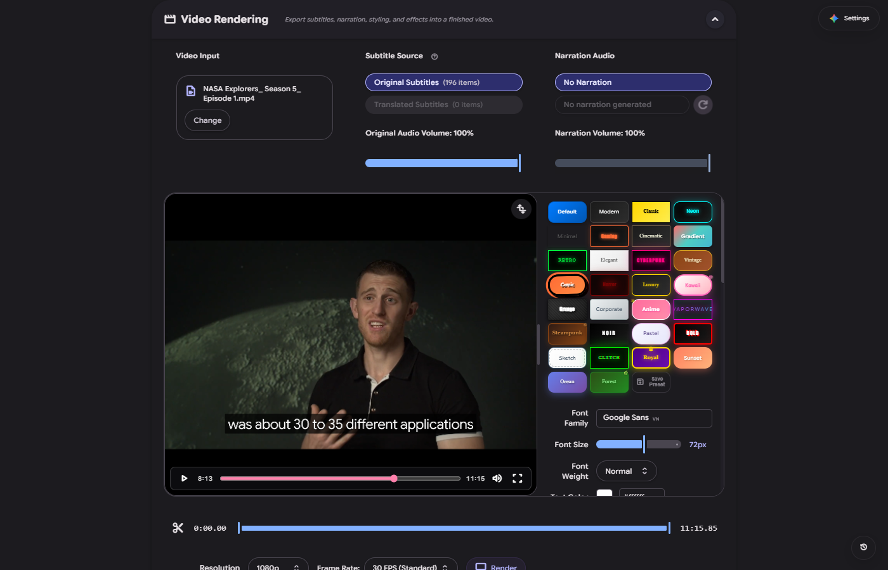

# OSG — One-Click Subtitles Generator

[Tiếng Việt](README.vi.md)

Generate subtitles, fix their timing, translate them, and render them into your video.
A Windows desktop app with a timeline editor, narration tools, and a native Rust video renderer.

**[Download OSG 1.0.0 for Windows x64](https://github.com/nganlinh4/oneclick-subtitles-generator/releases/download/v1.0.0/OSG-1.0.0-windows-x64-setup.exe)** · [Release notes](https://github.com/nganlinh4/oneclick-subtitles-generator/releases/tag/v1.0.0) · [Report a bug](https://github.com/nganlinh4/oneclick-subtitles-generator/issues)



*[NASA Explorers: Artemis Generation](https://www.youtube.com/watch?v=2eFHWuNuDSA), with its YouTube captions downloaded and displayed in OSG. Footage: NASA's Goddard Space Flight Center. [Capture details](docs/images/readme/README.md).*

## From video to subtitles

Open a video or audio file, or paste a supported video URL. Generate subtitles with Gemini or an
optional local speech-recognition engine—or import an existing subtitle file and start editing.

- **Edit against the video.** Adjust text and timing on the waveform timeline, work on a selected
  range, and undo changes.
- **Translate and review.** Translate subtitles without leaving the editor, then save a subtitle
  file or continue to video export.
- **Style the result.** Choose fonts, placement, colors and effects with a video preview.
- **Add narration.** Generate speech with your chosen provider or downloadable local engine.



## Before you start

- **Windows x64 only.** No Node.js or development server needed. Video export requires a compatible
  Direct3D GPU and driver; software-only Windows VMs are not supported for native export.
- **Bring your own Gemini API keys** for Gemini features. Provider quotas, availability and charges
  apply. Optional local speech engines download separately and may need several GB of storage
  and suitable hardware.
- **Tools install when needed.** You do not need to set up FFmpeg, yt-dlp or Deno by hand.
- **Windows may show an unsigned-publisher warning.** The installer is not Authenticode-signed;
  in-app updates are verified separately with a signature.

Projects and settings stay on your machine. API keys use the operating-system credential store.
Cloud operations send the required media or text to the provider you choose—not every feature
works offline.

<details>
<summary>Coming from the old batch-file edition?</summary>

OSG 1.0.0 is the new native application, not an automatic downgrade from legacy 2.x.
Migration is manual; keep your old data until you have checked the import.
See the [migration guide](https://github.com/nganlinh4/oneclick-subtitles-generator/blob/rewrite/tauri-rust/docs/DEVELOPMENT.md#data-and-migration).

The [v2.6.1 release](https://github.com/nganlinh4/oneclick-subtitles-generator/releases/tag/v2.6.1)
and its [Windows batch installer](https://github.com/nganlinh4/oneclick-subtitles-generator/releases/download/v2.6.1/OSG_installer_Windows.bat)
remain available. The generic Latest link now points to native OSG.

</details>

<details>
<summary>Build from source</summary>

Native development lives on **`rewrite/tauri-rust`**. For now, `main` keeps the legacy application
code so existing batch-file users are not broken.

Install the prerequisites in the [development guide](https://github.com/nganlinh4/oneclick-subtitles-generator/blob/rewrite/tauri-rust/docs/DEVELOPMENT.md), then:

```powershell
git fetch origin
git switch rewrite/tauri-rust
npm ci
npm --prefix apps/desktop ci
npm run tauri:dev
```

Use the managed launch command, not the debug executable alone: it starts the development server too.

[Architecture](https://github.com/nganlinh4/oneclick-subtitles-generator/blob/rewrite/tauri-rust/ARCHITECTURE.md) ·
[Development cache](https://github.com/nganlinh4/oneclick-subtitles-generator/blob/rewrite/tauri-rust/docs/rewrite/DEVELOPMENT_CACHE.md) ·
[UI design policy](https://github.com/nganlinh4/oneclick-subtitles-generator/blob/rewrite/tauri-rust/docs/rewrite/DESIGN.md) ·
[Release validation](https://github.com/nganlinh4/oneclick-subtitles-generator/blob/rewrite/tauri-rust/docs/release/WINDOWS-1.0-VALIDATION.md)

</details>

## License

OSG is [MIT licensed](https://github.com/nganlinh4/oneclick-subtitles-generator/blob/rewrite/tauri-rust/LICENSE).
Models, fonts and other dependencies have their own terms:
[third-party notices](https://github.com/nganlinh4/oneclick-subtitles-generator/blob/rewrite/tauri-rust/THIRD_PARTY_NOTICES.md).
For security reports, see [SECURITY.md](https://github.com/nganlinh4/oneclick-subtitles-generator/blob/rewrite/tauri-rust/SECURITY.md).
